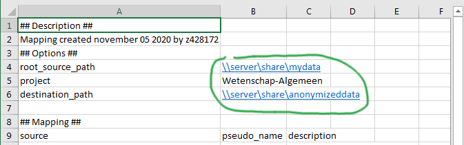

.. _tutorials:

=========
Tutorials
=========

Step-by-step instructions on how to perform particular tasks with anonapi.

.. Note::
    These instructions use windows paths and screenshots, but all commands work the same way for linux. In addition,
    :ref:`input files<concepts_input_file>` are referred to as excel files, but csv format is also accepted

Anonymize from PACS
===================

How to anonymize data when you have a list of accession numbers

.. _anonymize_from_pacs_requirements:

Requirements
------------
For this tutorial you need the following:

* ``C:\project_folder`` - A folder that will hold records of the jobs created. Anonymized data does not have to go into this folder.

* ``C:\project_folder\accession_numbers.xlsx`` - An excel or csv :ref:`input file<concepts_input_file>` containing
  a list of accession numbers that you want to anonymize. This file could be anywhere, but for convenience it is inside the
  project folder in this tutorial.

The path and file above are just examples. They can be anything you like.

Step 1: prepare input file
--------------------------

To start, open ``accession_numbers.xlsx`` and check the following:

* The file `must` contain a column with header ``accession_number``

* The file `may` contain a column with header ``pseudonym``. These pseudonyms will be used if found.

* The file `may` contain any other columns and text. These will all be ignored for example, The following
  is a valid input file:

.. code-block:: text

    Some text here does not matter
    The column 'project' below will also just be ignored

    accession_number    pseudonym  project
    1234567.12345678    studyA     some_projectA
    2234567.12345678    studyB     some_projectB
    3234567.12345678    studyC     some_projectB

Step 2: add input to mapping
----------------------------

* Find your :ref:`project folder<anonymize_from_pacs_requirements>` ``C:\project_folder`` in windows explorer, ``shift + right-click`` -> ``Open command prompt``
  (see :ref:`opening a command prompt<usage_starting_a_command_prompt_windows_in_folder>`)

* In the command line, run the following:

.. code-block:: text

    $ anon map init
    $ anon map add-accession-numbers --input-file accession_numbers.xlsx

* Now open the mapping for editing:

.. code-block:: text

      anon map edit

.. tip::

    If values are not sorted into columns properly in excel, do the following:

    * ``select column A`` -> click menu ``Data`` -> click ``Text to Columns``
    * In the menu choose ``delimited`` -> click ``Next``
    * Under 'delimiters' check either ``Comma`` or ``Semicolon`` -> click ``Next``

make the following edits (as shown in the image below):

* ``project`` should have the correct anonymization project (usually 'Wetenschap-Algemeen')

* ``destination_path`` should be an be a :ref:`UNC path <concepts_unc_paths>` (like `\\\\server\\share`) where you want
  your anonymized data to be written.

Step 3: create jobs
-------------------

Make sure you have a :ref:`command prompt<usage_starting_a_command_prompt_windows_in_folder>` in your
:ref:`project folder<anonymize_from_pacs_requirements>` ``C:\project_folder``. Then run the following:

.. code-block:: text

    $ anon create from-mapping

This will create all jobs defined in your mapping file and save a reference to them as a :ref:`batch <concepts_batch>`.

Step 4: monitor job batch
-------------------------

To see how your jobs are doing use

.. code-block:: text

    $ anon batch status

To print error messages for all failed jobs use

.. code-block:: text

    $ anon batch show-error

Other batch commands can be found :ref:`here <batch>`.

Anonymize from a share
======================

How to anonymize data when you have data for a large number of patients on a share and want to anonymize several, but not all of these.

.. _anonymize_from_share_requirements:

Requirements
------------
For this tutorial you need the following:

* ``C:\project_folder`` - A folder that will hold records of the jobs created. Anonymized data does not have to go into
  this folder.

* ``\\server\share\mydata`` - The data to anonymize. This share should contain a folder for each patient or each study
  that you wish to anonymize. The folders `may` contain subfolders and/or non-DICOM files. Files in subfolders will be
  included. Non-DICOM files will be ignored. For this tutorial, we will assume the following simple structure with 5
  patients:

    .. image:: static/server_share_mydata_example.png
        :scale: 100 %
        :alt: command edits after anon map init

* ``C:\project_folder\folders.xlsx`` - An excel or csv :ref:`input file<concepts_input_file>` containing
  a list of folder names that you want to anonymize. This file could be anywhere, but for convenience it is inside the
  project folder in this tutorial.

The paths above are just examples. They can be anything you like.

Step 1: prepare input file
--------------------------

To start, open the :ref:`input file<concepts_input_file>` ``folders.xlsx`` and check the following:

* The file `must` contain a column with header ``folder``, containing the names of the folders you want to anonymize from ``\\server\share\mydata``

* The file `may` contain a column with header ``pseudonym``. These pseudonyms will be used if found.

For example:

.. code-block:: text

    folder       pseudonym
    patient1     anon_patientA
    patient3     anon_patientB
    patient5     anon_patientC

Step 2: add input to mapping
----------------------------

* Find your :ref:`project folder<anonymize_from_pacs_requirements>` ``C:\project_folder`` in windows explorer, ``shift + right-click`` -> ``Open command prompt``
  (see :ref:`opening a command prompt<usage_starting_a_command_prompt_windows_in_folder>`)

* In the command prompt, type ``anon map init`` and press enter. Then close the prompt again.

* Now find ``\\server\share\mydata`` in windows explorer and ``shift + right-click`` -> ``Open command prompt`` there.

.. note::
    windows command prompt will show this location as a mapped drive letter like ``H:\`` or ``X:\``. This
    is not a problem here. When setting source and destination locations later on in this tutorial, be sure to always
    use the ``\\server\share`` form, never the drive letter.

* In the command prompt, type the following:

.. code-block:: text

    $ anon map add-study-folders --input-file "C:\project_folder\folders.xlsx"

This command might take some time to complete as it will scan for all DICOM files in each of the folders.

* Now open the mapping for editing:

.. code-block:: text

      anon map edit

.. tip::
    If values are not sorted into columns properly in excel do the following:

    * ``select column A`` -> click menu ``Data`` -> click ``Text to Columns``
    * In the menu choose ``delimited`` -> click ``Next``
    * Under 'delimiters' check either ``Comma`` or ``Semicolon`` -> click ``Next``

make the following edits (as shown in the image below):

* ``root_source_path`` should be ``\\server\share\mydata``, the root folder that contains each of your patient or study folders

* ``project`` should have the correct anonymization project (usually 'Wetenschap-Algemeen')

* ``destination_path`` should be an be a :ref:`UNC path <concepts_unc_paths>` (like `\\\\server\\share`) where you want
  your anonymized data to be written.

Step 3: create jobs
-------------------

Make sure you have a :ref:`command prompt<usage_starting_a_command_prompt_windows_in_folder>` in your
:ref:`project folder<anonymize_from_pacs_requirements>` ``C:\project_folder``. Then run the following:

.. code-block:: text

    $ anon create from-mapping

This will create all jobs defined in your mapping file and save a reference to them as a :ref:`batch <concepts_batch>`.

Step 4: monitor job batch
-------------------------

To see how your jobs are doing use

.. code-block:: text

    $ anon batch status

To print error messages for all failed jobs use

.. code-block:: text

    $ anon batch show-error

Other batch commands can be found :ref:`here <batch>`.